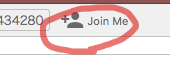

# Jumper Game
Akashic Engineを用いたマルチプレイゲームのサンプルです。ニコ生上で動作させることを前提に作ってあります。


# how to use
Akashic Engineの開発環境を整えた後以下を実行します


```
npm install
npm run build
akashic serve
```

成功するとゲームサーバーが自分のPCに起動します。  
デフォルトではhttp://localhost:3300へブラウザからアクセスできます。複数のタブを開くなどしてアクセスすれば、複数人いる状況を再現できます。
また、このゲームはニコ生で動作させることが前提であるため、ゲーム起動後に一度、Joinと呼ばれるAkashic Engineの仕組みを呼び出す必要があります。  
放送者相当の画面にて画面上部のJoin Meボタンを押すことでJoinが行われ、ゲームが動作します。  



一度Joinが行われた後は、他の画面からJoinしたり、Leaveしたりしても何も起きません。放送者が**ゲーム起動後一度だけ**Joinする必要があります。  
Joinについての詳しい説明は、[ニコニコ新市場技術資料wiki](https://github.com/akashic-contents/shin-ichiba-doc/wiki/%E3%83%9E%E3%83%AB%E3%83%81%E3%83%97%E3%83%AC%E3%82%A4%E3%82%B2%E3%83%BC%E3%83%A0%E3%82%92%E4%BD%9C%E3%82%8D%E3%81%863-Join%E3%81%A8Leave%E3%81%A8%E3%83%8B%E3%82%B3%E7%94%9F%E3%81%AE%E8%A9%B1)などをご参照ください。


# ゲームのルール説明
徐々に迫ってくる左端に飲み込まれないよう、自分のJumperを右に進めていきます。  
迫ってくる障害物に当たると足が止まってしまうため、ジャンプで上手く避けます。

また、障害物に近い場所でジャンプするとジャストジャンプとなり、少し前進することができます。  
しかしジャンプ準備中に障害物に当たると通常より大きく足が止まってしまうため、リスク管理が大事です。

安定をとって早めにジャンプするか、ジャストジャンプで前に進むかを選択しつつ、最後の一人になるまで走り続けてください。


# ライセンス
本リポジトリは MIT License の元で公開されています。
詳しくは [LICENSE](LICENCE) をご覧ください。

ただし、画像ファイルおよび音声ファイルは
[CC BY 2.1 JP](https://creativecommons.org/licenses/by/2.1/jp/) の元で公開されています。
